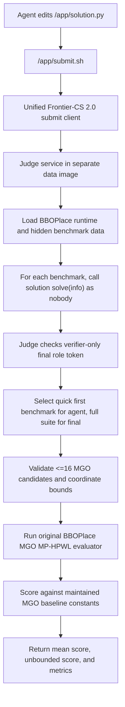

BBOPlace Frontier-CS 2.0 Integration Plan
=========================================

Current direction:

- Use the unified `frontier-cs-2.0` Harbor adapter, not a standalone
  BBOPlace adapter.
- Add two algorithmic suite tasks: `bboplace_ispd2005` and
  `bboplace_iccad2015`.
- Add two direct-placement single-design tasks:
  `bboplace_direct_ispd2005` for `adaptec1` and
  `bboplace_direct_iccad2015` for `superblue1`.
- Keep the agent/main container separate from the judge/data container.
- During agent iteration, score only the first benchmark in each suite for fast
  general-design feedback. During final verification, score the full suite.
- For direct-placement tasks, both iterative feedback and final verification
  score the same single design. The agent submits `/app/solution.json` instead
  of a Python generator.
- The judge accepts `final` evaluation role only when the hidden verifier sends
  the generated role token. Agent submissions, including hand-written judge
  requests, are treated as quick-feedback submissions.
- The submit helper stores the best quick-feedback artifact. The verifier
  reruns that artifact on the full suite and compares it with the current final
  solution, so quick scores are never used directly as final rewards.
- Prebuild a BBOPlace judge image with the original BBOPlace-Bench runtime and
  extracted ISPD2005 plus ICCAD2015 data. The evaluator uses only MGO +
  MP-HPWL, so the image does not need Ray, HPO, DREAMPlace, or GPU packages.

Suite evaluation flow:

Direct-placement tasks use the same judge image and scoring path, but the agent
edits `/app/solution.json`, the evaluator reads exactly one placement, and both
agent feedback and final verification evaluate the fixed single design.

Scoring:

`score = max(0, 100 * (baseline_hpwl - candidate_hpwl) / baseline_hpwl)`

The final task score is the mean across the benchmarks in that variant. The
unbounded score is the mean before the zero clip.

Baseline constants:

- ISPD2005: BBOPlace-Bench report Table III, `MGO + Vanilla-EA`, MP-HPWL,
  paper unit `x10^5`, relaxed by `1.2x` for scoring.
- ICCAD2015: BBOPlace-Bench report Table V, `MGO + PSO`, MP-HPWL, paper unit
  `x10^5`, relaxed by `1.2x` for scoring.

Data status:

- ISPD2005 checked locally from the official ISPD tarballs. The extracted data
  is about 967 MiB.
- ICCAD2015 checked locally from the BBOPlace-Bench Google Drive package. The
  extracted data is about 2.2 GiB.
- Parser smoke tests succeeded for `adaptec1` and `superblue1`.

Future extension:

- Add additional direct-placement single-design tasks if we want more
  fine-tuning targets. Keep them separate from the suite-style algorithmic
  tasks so direct placement and general design are measured independently.
